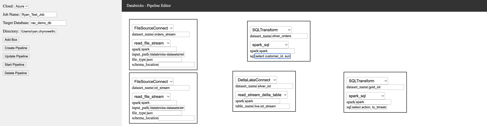
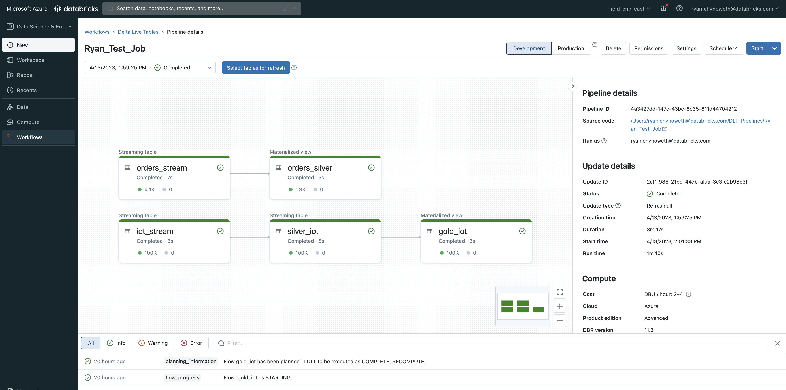

# Streaming Application - A Drag and Drop Tool 

This repository is a demo example of how to build a streaming platform and drag and drop UI on top of Databricks. The underlying technologoy is Apache Spark Structured Streaming on Databricks. In order to create an application it does require a class library of connectors and transformers to allow drag and drop pipeline creation. In this repository we will use this [library](https://github.com/rchynoweth/StreamingTemplates) as an example. The `dlt_platform` library is simply an example of how to simplify streaming on Databricks i.e. connecting to Kafka can now to be 

**Drag and Drop UI - No Coding Required**  


<br></br>

**Databricks Pipeline - Easily Deploy**   



<br></br>
The drag and drop UI generates a notebook that is deployed on Databricks. Users can make custom edits to the notebook outside of the drag and drop UI. Please see the example notebook [here](https://github.com/rchynoweth/StreamingApp/blob/main/docs/Ryan_Test_Job.py). 

## Running the Application

Run the following from the repository root workspace. 
```
conda activate webapp
export FLASK_APP=app/main.py
export FLASK_ENV=development
flask run 
```

You may need to install the dependent library with the following:
```
pip install git+https://github.com/rchynoweth/StreamingTemplates.git@main
```


## Demo Outline 

FileSourceConnect.read_file_stream - Example Input
- datasetName: orders_stream
- input_path: /databricks-datasets/retail-org/sales_orders/
- file_type: json


FileSourceConnect.read_file_stream - Example Input
- datasetName: iot_stream
- input_path: /databricks-datasets/structured-streaming/events
- file_type: json


DeltaLakeConnect.read_stream_delta_table - Example Input
- dataset_name: silver_iot
- table_name: live.iot_stream


SQL Transforms 

```
select action, to_timestamp(time) as datetime, time, date_format(from_unixtime(time), "yyyy-MM-dd HH:00:00") as hourly_datetime 
from live.silver_iot


select customer_id, sum(number_of_line_items) as number_of_line_items 
from live.orders_stream 
group by customer_id
```

